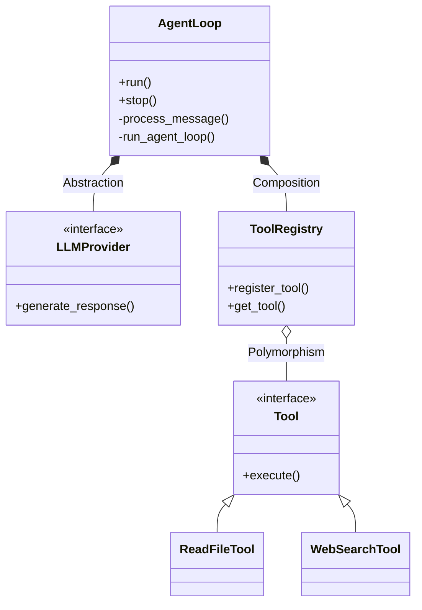

## Object-Oriented Thinking in AI Agent Orchestration

When building complex AI Agent systems, the `loop.py` file—the heart of the ReAct (Reasoning and Acting) orchestration loop—is the true testament to architectural strength. Simply writing standalone scripts quickly reveals limitations in maintainability and scalability.

Instead, applying the four classic principles of Object-Oriented Programming (OOP) allows us to encapsulate a professional "Agent Loop," ensuring both robustness and flexibility.

---

## 1. Encapsulation

The `AgentLoop` class hides internal execution complexities. System users or other modules do not need to interfere with how messages are processed or how LLMs are invoked.

- **Implementation:** Sensitive logic like `_process_message` or `_run_agent_loop` is defined as private methods.
- **Benefit:** Ensures data integrity and execution flow. Users interact only through a clean API: `run()`, `stop()`, or `process_direct()`.

**Class Structure Illustration:**
```python
class AgentLoop:
    def __init__(self, agent_id: str):
        self.__state = "IDLE" # Private state

    def run(self):
        self.__state = "RUNNING"
        self._run_agent_loop() # Internal execution

    def _run_agent_loop(self):
        # Complex logic lives here
        pass
```

---

## 2. Abstraction

A professional AI Agent should not depend directly on a specific language model (GPT-4, Claude 3.5, or a Local LLM). It should only interact with an abstract interface: `LLMProvider`.

- **Implementation:** The Agent sends messages and receives responses through a unified interface. Calling specific APIs, handling network errors, or converting data formats is the responsibility of the Provider's subclass.
- **Benefit:** Easily switch models or backend infrastructures without modifying the Agent's core logic.

---

## 3. Composition

Instead of a "God Class" that contains everything, modern architecture prioritizes assembling specialized modules within the `AgentLoop`. The Agent then acts as the orchestrator:

- **ToolRegistry:** Manages the list of tools and skills available to the Agent.
- **SessionManager:** Manages state, conversation history, and caching.
- **ContextBuilder:** Constructs optimized prompts and context structures before sending them to the LLM.

**Composition Illustration:**
```python
class AgentLoop:
    def __init__(self):
        self.tools = ToolRegistry()
        self.session = SessionManager()
        self.context = ContextBuilder()
```

---

## 4. Polymorphism

This is the key to scalability. The Agent invokes a common `.execute()` method on every tool.

- **Implementation:** While it's the same function call, `ReadFileTool` will interact with the local filesystem, whereas `WebSearchTool` will invoke a third-party API.
- **Benefit:** New tools (such as MCP servers) can be easily "plugged in" without altering the core source code of the Agent Loop.

---

## Architecture Diagram (Mermaid)

Below is the class diagram illustrating the coordination between system components:



## Conclusion

The performance of an AI Agent is not just about prompt engineering or the underlying model's power. It lies in the **robust orchestration system** built on solid software engineering principles. Applying OOP to Agentic Workflows is the key to moving AI projects from experimentation to production-grade reality.

---

**What are your thoughts on applying traditional software architecture to AI? Share your perspective below.**
