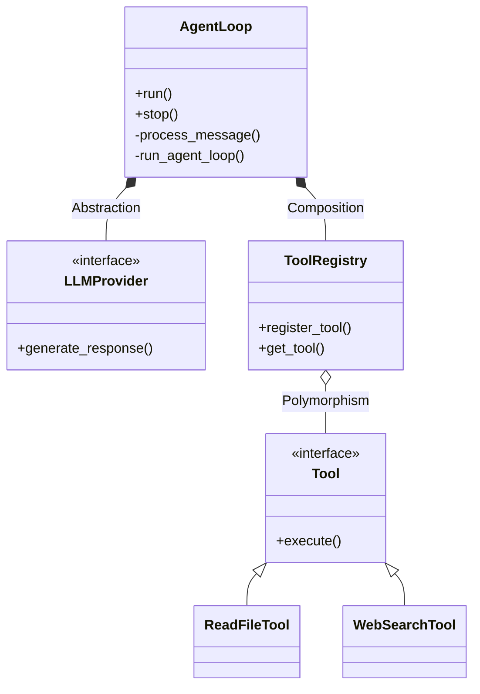

## Tư duy hướng đối tượng trong điều phối AI Agent

Trong việc xây dựng các hệ thống AI Agent phức tạp, tệp tin `loop.py` – nơi chứa vòng lặp điều phối ReAct (Reasoning and Acting) – được coi là "trái tim" của toàn bộ kiến trúc. Việc chỉ viết các kịch bản (scripts) đơn lẻ sẽ nhanh chóng bộc lộ những hạn chế về khả năng bảo trì và mở rộng. 

Thay vào đó, việc áp dụng 4 tính chất kinh điển của lập trình hướng đối tượng (OOP) giúp chúng ta đóng gói một "Agent Loop" thực thụ, đảm bảo tính bền bỉ và linh hoạt cho hệ thống.

---

## 1. Tính Đóng Gói (Encapsulation)

Lớp `AgentLoop` đóng vai trò che giấu các chi tiết thực thi phức tạp bên trong. Người dùng hệ thống hoặc các module khác không cần can thiệp vào cách thức tin nhắn được xử lý hay cách LLM được gọi.

- **Thực thi:** Các logic nhạy cảm như `_process_message` hay `_run_agent_loop` được định nghĩa dưới dạng phương thức private.
- **Lợi ích:** Đảm bảo tính toàn vẹn của dữ liệu và luồng thực thi. Người dùng chỉ tương tác qua bộ giao diện (API) sạch sẽ như `run()`, `stop()`, hoặc `process_direct()`.

**Minh họa cấu trúc lớp:**
```python
class AgentLoop:
    def __init__(self, agent_id: str):
        self.__state = "IDLE" # Private state

    def run(self):
        self.__state = "RUNNING"
        self._run_agent_loop() # Internal execution

    def _run_agent_loop(self):
        # Logic phức tạp nằm ở đây
        pass
```

---

## 2. Tính Trừu Tượng (Abstraction)

Một AI Agent chuyên nghiệp không nên phụ thuộc trực tiếp vào một mô hình ngôn ngữ cụ thể nào (GPT-4, Claude 3.5, hay Local LLM). Nó chỉ nên tương tác với một giao diện trừu tượng là `LLMProvider`.

- **Thực thi:** Agent gửi tin nhắn và nhận phản hồi thông qua giao diện chung. Việc gọi API cụ thể, xử lý lỗi mạng hay chuyển đổi định dạng dữ liệu là trách nhiệm của lớp kế thừa Provider.
- **Lợi ích:** Dễ dàng thay đổi mô hình ngôn ngữ hoặc hạ tầng backend mà không phải sửa đổi logic cốt lõi của Agent.

---

## 3. Tính Hợp Thành (Composition)

Thay vì tạo ra một lớp "vạn năng" chứa đựng mọi tính năng, kiến trúc hiện đại ưu tiên việc lắp ghép các module chuyên biệt vào trong `AgentLoop`. Lúc này, Agent đóng vai trò là nhạc trưởng điều phối:

- **ToolRegistry:** Quản lý danh sách các công cụ và kỹ năng mà Agent có thể sử dụng.
- **SessionManager:** Quản lý trạng thái, lịch sử hội thoại và bộ nhớ đệm (Cache).
- **ContextBuilder:** Xây dựng Prompt và cấu trúc ngữ cảnh tối ưu trước khi gửi cho LLM.

**Minh họa cấu trúc Hợp thành:**
```python
class AgentLoop:
    def __init__(self):
        self.tools = ToolRegistry()
        self.session = SessionManager()
        self.context = ContextBuilder()
```

---

## 4. Tính Đa Hình (Polymorphism)

Đây là mấu chốt để hệ thống có khả năng mở rộng (Scalability). Agent thực hiện lệnh gọi chung một phương thức `.execute()` trên mọi công cụ (Tool).

- **Thực thi:** Tuy cùng một lời gọi hàm, nhưng `ReadFileTool` sẽ thực hiện thao tác trên ổ cứng, trong khi `WebSearchTool` sẽ gọi API bên thứ ba.
- **Lợi ích:** Hệ thống có thể dễ dàng "cắm" thêm các công cụ mới (như MCP server) mà không cần can thiệp vào mã nguồn lõi của Agent Loop.

---

## Sơ đồ kiến trúc (Mermaid Diagram)

Dưới đây là sơ đồ lớp minh họa sự phối hợp giữa các thành phần trong hệ thống:



## Kết luận

Hiệu năng của một AI Agent không chỉ nằm ở sức mạnh của mô hình ngôn ngữ hay Prompt Engineering. Nó nằm ở **hệ thống điều phối bền bỉ** được xây dựng trên những nguyên lý kỹ thuật phần mềm vững chắc. Việc áp dụng OOP vào Agentic Workflow chính là chìa khóa để đưa các dự án AI từ mức độ thử nghiệm lên quy mô sản xuất thực tế.

---

**Bạn đánh giá thế nào về việc áp dụng kiến trúc phần mềm truyền thống vào AI? Hãy chia sẻ ý kiến của mình nhé.**
